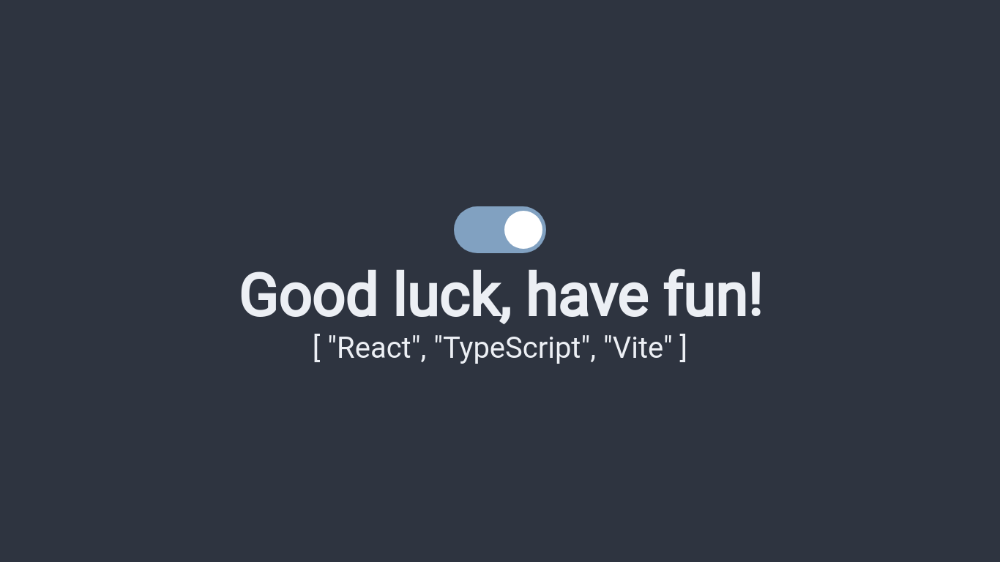

<div align="center">
<h1>Retivite</h1>
<p>
<a href="https://github.com/facebook/react">

</a>
<a href="https://github.com/Microsoft/TypeScript">

</a>
<a href="https://github.com/vitejs/vite">

</a>
<br>
Just another one of tons out there where react boilerplate exists.
<br>
</p>
</div>

<p align="center">

</p>

## Includes
- [ReactJS](https://reactjs.org)
- [TypeScript](https://www.typescriptlang.org)
- [Vite](https://vitejs.dev)
- [Chakra UI](https://chakra-ui.com)
- [Framer Motion](https://www.framer.com/motion/)

## Getting started
```bash
npx degit qqhgs/retivite my-app
cd my-app
git init
pnpm / yarn / npm install
pnpm run dev
```

## Knowledge
This boilerplate write using `neovim`, something like `eslint` and `prettier` handled by neovim in another way than `vscodium`.

## TODO
- Add jest & testing library

